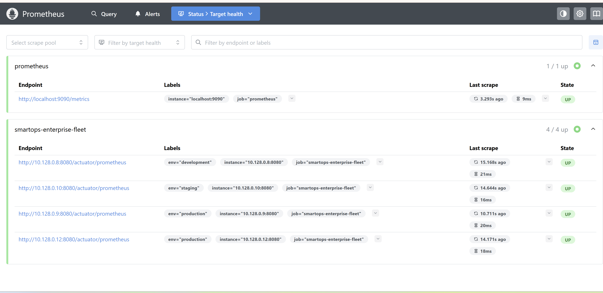
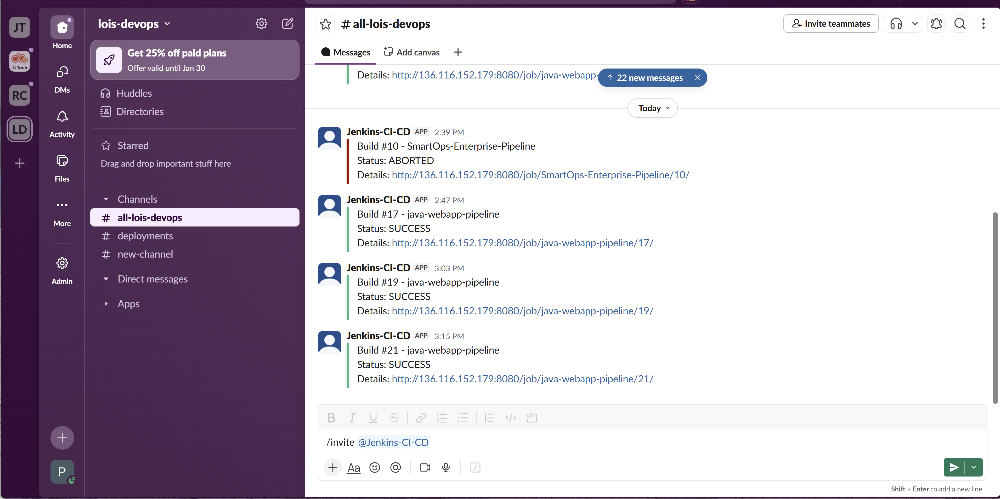

# Caprivax CI/CD Platform 
### Enterprise-Grade Infrastructure-as-Code & Automated Observability on GCP

---

##  Project Overview
This repository contains the complete architecture for a multi-environment CI/CD platform deployed on Google Cloud Platform. It utilizes a **Modular Monorepo** pattern to manage Infrastructure-as-Code (IaC), automated server hydration, and a full observability stack.

### Key Highlights
* **Separation of Planes:** Logic divided into a "Management Plane" (Control Center) and "Data Plane" (Dev/Staging/Prod).
* **Binary-to-Metric Pipeline:** Automated flow from Java source code to Prometheus-scraped JVM metrics.
* **Artifact Integrity:** Immutable versioning using Nexus Repository Manager for reliable rollbacks.
* **Full-Stack Monitoring:** Real-time health visualization via Grafana, monitoring JVM heap, CPU, and Uptime.

---

## 🏗️ Repository Structure
caprivax-cicd-platform/
├── bootstrap/                    # Standalone Management Plane (Hydration scripts)
├── smartops-backend/             # Spring Boot API with Actuator & Micrometer
├── ansible/                      # Configuration Management (Deployment & Systemd)
├── jenkins-infrastructure/       # The Data Plane (Terraform Modules)
│ ├── modules/                    # Reusable blocks (Networking, Monitoring, IAM)
│ └── environments/               # Environment-specific configs (Dev, Staging, Prod)
├── terraform-pipelines/          # Groovy Pipelines-as-Code for Jenkins orchestration
├── docs/                         # Project Documentation & Screenshots
│ ├── pipeline.png                # Jenkins Pipeline Visualization
│ ├── prometheus-targets.png      # Monitoring Dashboard
│ ├── grafana.png                 # Grafana Metrics
│ └── slack.png                   # Alert Notifications
└── README.md                     # Project Overview

---

##  Deployment Logic & Visual Evidence

### 1. The Management Plane (The Director)
The platform is anchored by a hydrated Manager VM. This acts as the Jenkins Controller, Nexus Repository, and Monitoring Hub. It orchestrates the lifecycle of the entire fleet.

### 2. Automated Application Lifecycle
* **Build:** Jenkins compiles the SmartOps API into an executable "Fat JAR".
* **Quality:** SonarQube scans for vulnerabilities and code smells.
* **Deploy:** Ansible fetches the versioned JAR from Nexus and deploys it to target VMs, configuring the `systemd` unit for high availability.

  
   
  <i>Visual proof of the multi-stage CI/CD pipeline execution.</i>

### 3. Full-Stack Observability & Alerting
Deployed as a Docker-composed stack, featuring real-time health visualization and proactive alerting.

* **Prometheus:** Scrapes `/actuator/prometheus` endpoints across the fleet.
* **Grafana:** Visualizes health via Dashboard 11378 (JVM Micrometer Statistics).
* **Slack:** Automated notifications for deployment status and system alerts.

  
   
  <i>Prometheus health dashboard showing 4/4 active 'smartops-enterprise-fleet' targets.</i>

  
  
   
  <i>Live JVM Telemetry Dashboard (Left) and Automated Slack Notifications (Right).</i>

---

##  Security & Stability Posture
* **Least Privilege:** CI/CD actions performed via dedicated Service Accounts.
* **Network Isolation:** Internal communication restricted to authorized ports (8080 for API, 9090 for Scraping).
* **Stability:** Optimized Management Plane with 2.00 GiB Swap configuration to ensure build reliability.

---

##  Technical Challenges & Solutions

| Challenge | Solution |
|-----------|----------|
| **Configuration Drift** | Resolved `systemd` failures by using Ansible to enforce state across the fleet. |
| **Resource Exhaustion** | Mitigated Jenkins build failures by implementing a 2.00 GiB Linux swapfile on the Management Plane. |
| **Artifact Portability** | Integrated the `spring-boot-maven-plugin` to repackage standard JARs into executable "Fat JARs." |

---

## 👤 Author
**Marcel Owhonda** - Cloud & DevOps Engineer  
* GitHub: [@Marcel2tight](https://github.com/Marcel2tight)  
* LinkedIn: [Marcel Owhonda](https://www.linkedin.com/in/marcel-owhonda-devops)

---

> This project demonstrates advanced expertise in GCP Cloud Engineering, Java Application Lifecycle Management, and Enterprise Monitoring.