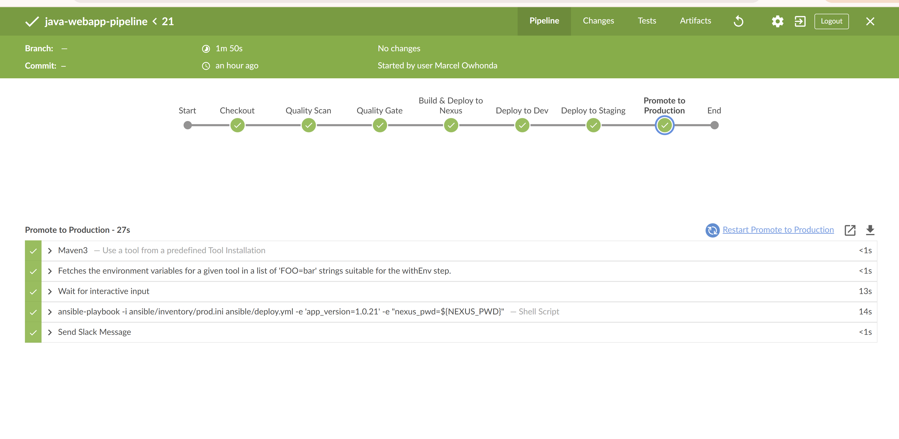
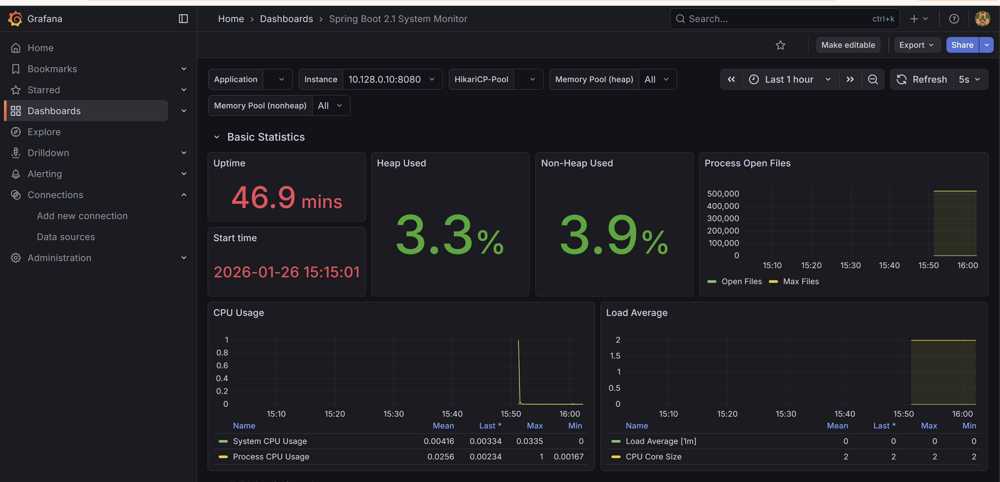

# Caprivax CI/CD Platform 🚀
### Enterprise-Grade Infrastructure-as-Code & Automated Observability on GCP

     

📌 **Project Overview**
This repository contains the complete architecture for a multi-environment CI/CD platform deployed on Google Cloud Platform. It utilizes a **Modular Monorepo** pattern to manage Infrastructure-as-Code (IaC), automated server hydration, and a full observability stack.

---

### 🏗️ Technical Architecture Diagram

```mermaid
graph TD
    subgraph "Management Plane (GCP VM)"
        J[Jenkins Controller]
        N[Nexus Repository]
        P[Prometheus]
        G[Grafana]
    end

    subgraph "Data Plane (GCP VPC)"
        D[Dev Instance: 10.128.0.8]
        S[Staging Instance: 10.128.0.10]
        P1[Prod Instance 1: 10.128.0.9]
        P2[Prod Instance 2: 10.128.0.12]
    end

    GitHub[GitHub Repo] -->|Webhook| J
    J -->|Maven Build| N
    J -->|Ansible Deploy| D & S & P1 & P2
    D & S & P1 & P2 -->|Metrics /actuator| P
    P -->|Data Source| G
    User((Engineer)) -->|IAP Tunnel| J
🚀 Deployment Logic & Visual Evidence1. Automated Application LifecycleBuild: Jenkins compiles the SmartOps API into an executable "Fat JAR".Quality: SonarQube scans for vulnerabilities and code smells.Deploy: Ansible fetches the versioned JAR from Nexus and deploys it to target VMs.<p align="center"><i>Visual proof of the multi-stage CI/CD pipeline execution.</i></p>2. Observability StackDeployed as a Docker-composed stack, featuring real-time health visualization via Dashboard 11378.<p align="center"><i>Live telemetry showing JVM Heap, CPU usage, and system uptime.</i></p>🧠 Technical Challenges & SolutionsChallengeSolutionConfiguration DriftResolved systemd failures by using Ansible to enforce state across the fleet.Resource ExhaustionMitigated Jenkins failures by implementing a 2GB Linux swapfile on the Management Plane.Observability GapsInstrumented Spring Boot with Micrometer and Prometheus Actuator for deep telemetry.👤 AuthorMarcel Owhonda - Cloud & DevOps EngineerGitHub: @Marcel2tightLinkedIn: Marcel Owhonda